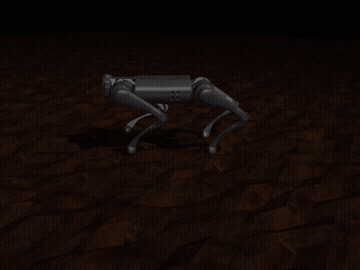

# rl-policy-lifecycle

Scripts covering the training-to-deployment lifecycle for RL locomotion and
manipulation policies trained with [mujoco_playground](https://github.com/google-deepmind/mujoco_playground)
(JAX/MJX, Brax PPO): checkpoint export to ONNX, interactive sim2sim deployment,
and a policy robustness evaluator.

This is not a fork of mujoco_playground. It's a small set of original scripts
that sit on top of it. mujoco_playground and mujoco_menagerie must be
installed separately (see Setup).

## Why the evaluator exists

`eval/episode_reward` from a training run is a scalar average over whatever
commands got sampled that eval pass. It doesn't say anything about *which*
commands the policy handles well. Two checkpoints from the same H1 humanoid
locomotion run illustrate the gap:

| checkpoint | eval reward | fall rate | avg survival |
|---|---|---|---|
| H1 humanoid, 103M steps | 74.4 | 87.5% | 37.8% |
| H1 humanoid, 300M steps | 68.2 (peaked 77.8 @ 68.8M, declined after) | 68.8% | 73.8% |

By reward alone the 103M checkpoint looks equal or better. `fall_diagnostic.py`
rolls out N episodes with independently sampled commands and tracks per-episode
survival against the env's own fall/termination condition, decoupled from the
reward signal entirely. Under that measure the 300M checkpoint is roughly twice
as robust. The reward curve was not wrong, it just wasn't answering the
question that mattered for picking a checkpoint to deploy.

The same script, unmodified, also measures a completely different morphology:

| checkpoint | fall rate | avg survival |
|---|---|---|
| Go1 quadruped, rough terrain | 18.8% | 94.2% |

Go1 is far more robust than either H1 checkpoint on the same command range.
That tracks with the underlying physics (a 4-point stance with a lower center
of mass is structurally easier to balance than a biped), but the point is this
is a measured number, not an assumption from watching a rollout video look
smooth for a few seconds.

## Scripts

**`export_onnx.py`** - loads a brax PPO checkpoint, rebuilds the policy as a
Keras MLP with weights transferred layer-by-layer, converts to ONNX, and
verifies the ONNX output matches the source JAX policy on a random observation
before accepting the export (fails loudly above 1e-3 max abs diff; typical
observed diff is ~1e-6).

```
uv run python scripts/export_onnx.py \
    --env_name Go1JoystickRoughTerrain \
    --checkpoint_path <path-to-checkpoint> \
    --output_path assets/go1_rough_policy.onnx
```

**`deploy_go1_keyboard.py`** - runs an exported ONNX policy interactively in
MuJoCo's passive viewer, with a keyboard-driven velocity command (W/A/S/D
translate, Q/E turn, space to zero) in place of a physical gamepad.

```
uv run python scripts/deploy_go1_keyboard.py --terrain rough
```

<p align="center">
  
</p>

**`fall_diagnostic.py`** - restores a checkpoint, rolls out N episodes in
parallel with independently sampled commands, and reports per-episode survival
length against the env's fall/termination condition, plus aggregate fall rate.
Env-agnostic; verified against both H1JoystickGaitTracking (humanoid) and
Go1JoystickRoughTerrain (quadruped).

```
uv run python scripts/fall_diagnostic.py \
    --env_name Go1JoystickRoughTerrain \
    --checkpoint_path <path-to-checkpoint> \
    --num_episodes 32
```

## ROS2 integration (Nav2)

`ros2/go1_policy_bridge` wraps the exported Go1 policy as a ROS2 node that
looks like a normal robot driver to the rest of a Nav2 stack: subscribes
`/cmd_vel`, runs the policy against a headless MuJoCo sim at 50Hz, and
publishes `/odom` plus the `odom -> trunk` TF from sim ground-truth sensors
(`position`/`orientation`/`local_linvel`/`gyro` on the Go1 model's IMU site).

The RL inference loop intentionally does not go through `ros2_control`. That
abstraction is built around classical position/velocity/effort controllers
with real-time and fixed-update-rate assumptions that don't map cleanly onto
"run a neural net and push joint targets as fast as possible" - the pattern
used across most learned-locomotion legged/humanoid platforms is a dedicated
inference loop with ROS2 sitting above it as the task/navigation layer, which
is what this node does. `ros2_control` is still the right tool for an
arm/manipulation stack sitting on top of this (e.g. via MoveIt2) - matching
the abstraction to the actual control pattern, not avoiding `ros2_control`
categorically.

Build and run inside a colcon workspace:

```
cd <your_ros2_ws>/src
cp -r <this_repo>/ros2/go1_policy_bridge .
cd <your_ros2_ws>
source /opt/ros/jazzy/setup.bash
colcon build --packages-select go1_policy_bridge
source install/setup.bash
```

The package imports `mujoco`/`onnxruntime`/`mujoco_playground` from the
`mujoco_playground` `uv` venv, but `colcon`/`ros2 run` execute under system
Python - these are two separate interpreters that don't share packages by
default. Point system Python at the venv's packages (and, if
`mujoco_playground` is an editable install, at its repo root, since editable
installs use a `.pth` file that only gets processed by a venv's own site-init,
not by a bare `PYTHONPATH` entry) before running:

```
export PYTHONPATH="<mujoco_playground_repo>:<mujoco_playground_repo>/.venv/lib/python3.12/site-packages:$PYTHONPATH"
ros2 run go1_policy_bridge policy_bridge_node --ros-args \
    -p policy_path:=<path-to-go1_rough_policy.onnx> \
    -p terrain:=rough
```

Then drive it like any other `/cmd_vel`-consuming robot (manual test, a
teleop node, or eventually Nav2 itself):

```
ros2 topic pub /cmd_vel geometry_msgs/msg/Twist "{linear: {x: 0.5}, angular: {z: 0.3}}" --once
ros2 topic echo /odom
```

### Nav2 bringup

`ros2/go1_policy_bridge/launch/nav2_bringup.launch.py` brings up a full Nav2
stack against the driver above: `controller_server` (DWB), `planner_server`,
`behavior_server` (recovery behaviors - Spin/BackUp/Wait, required by the
default `NavigateToPose` behavior tree), `bt_navigator`, `map_server`, a
lifecycle manager, and RViz2.

A few deliberate simplifications, since the goal here is proving the
navigation/control loop, not the localization stack:

- **No AMCL, no separate `map` frame.** The driver already publishes
  ground-truth `odom -> trunk` TF (see above), which is already "perfect
  localization" - estimating it again via AMCL would be solving a problem
  that doesn't exist yet. Every Nav2 component here uses `odom` directly as
  `global_frame`.
- **DWB configured as a holonomic base**, not differential-drive: the
  policy's command interface (`vx`/`vy`/`wz`) is independently controllable
  on all three axes, so `min_vel_y`/`max_vel_y` are nonzero rather than `0`.
- **A static map with only a border wall, no interior obstacles yet.**
  `config/maps/go1_rough_bounds.{pgm,yaml}` marks a ring of lethal cells
  matching the actual MuJoCo heightfield extent (`hfield size="10 10 .05
  1.0"` -> x,y in [-10, 10]). Costmap *size* bounds where the planner
  operates; it does not by itself mark anything as an obstacle. Learned this
  the hard way - the first version had no static layer, and a goal near the
  boundary sent the robot walking straight off the edge of the sim terrain,
  since nothing told the costmap that edge was lethal. Real obstacles inside
  the world (not just the boundary) are a planned follow-up.

Run it (driver already running per the section above):

```
ros2 launch go1_policy_bridge nav2_bringup.launch.py
```

In RViz2: set Fixed Frame to `odom`, add Map/TF/Path displays, and use "2D
Goal Pose" to send a goal. Validated end-to-end on a full diagonal
corner-to-corner goal: correct DWB holonomic tracking, path planned and
followed accurately against real ground-truth odometry, boundary respected.

**A note on visualizing this**, since it's a real trap: don't build a second,
separate MuJoCo instance that mirrors `/cmd_vel` for a "visual" of the
driver's behavior. It's tempting (and was tried here) - it avoids the
GLFW/rclpy crash that comes from putting a viewer in the same process as the
driver, since it's a fully separate process. But `/cmd_vel` is a body-frame
command: correct for the real driver (whose heading DWB is actually
computing against), meaningless applied to a second simulation with its own,
different accumulated heading. The two will visibly diverge - watched this
happen directly, where the real driver correctly tracked a diagonal path
while the separate mirrored simulation went off at a wrong angle and fell off
the map, despite both receiving identical commands. RViz2 (already part of
this bringup, subscribing to the driver's actual `/odom`/TF) is the only
visualization here that's guaranteed to represent what the driver is
actually doing.

## Setup

Requires a working mujoco_playground install (JAX/MJX, Brax, mujoco_menagerie
assets) - see the [mujoco_playground README](https://github.com/google-deepmind/mujoco_playground)
for install instructions, GPU requirements, and menagerie setup. `export_onnx.py`
additionally needs `tensorflow`, `tf2onnx`, and `onnxruntime`.

Run these scripts from the root of a mujoco_playground checkout, with this
repo's `scripts/` copied in or on `PYTHONPATH`.

## License

Code in this repo is MIT licensed (see `LICENSE`). mujoco_playground is
Apache-2.0 licensed; this repo depends on it but does not redistribute its
source.
